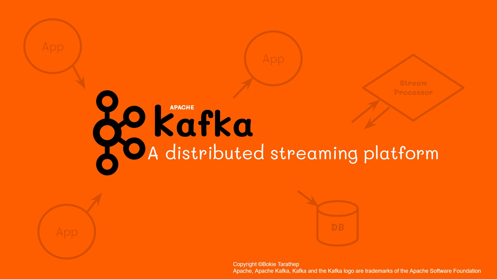

# Fundamentals Apache Kafka
Apache Kafka: A Distributed Streaming Platform

© 2017 Apache Software Foundation under the terms of the Apache License v2.
Apache Kafka, Kafka, and the Kafka logo are either registered trademarks or trademarks of The Apache Software Foundation in the United States and other countries.
https://kafka.apache.org/

## Slide

